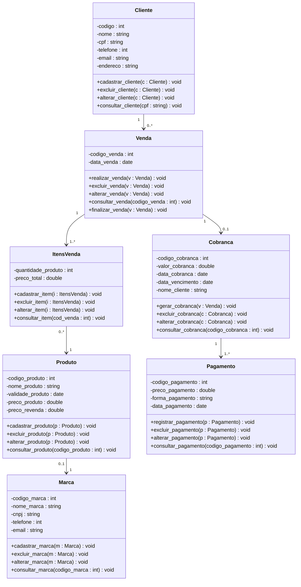
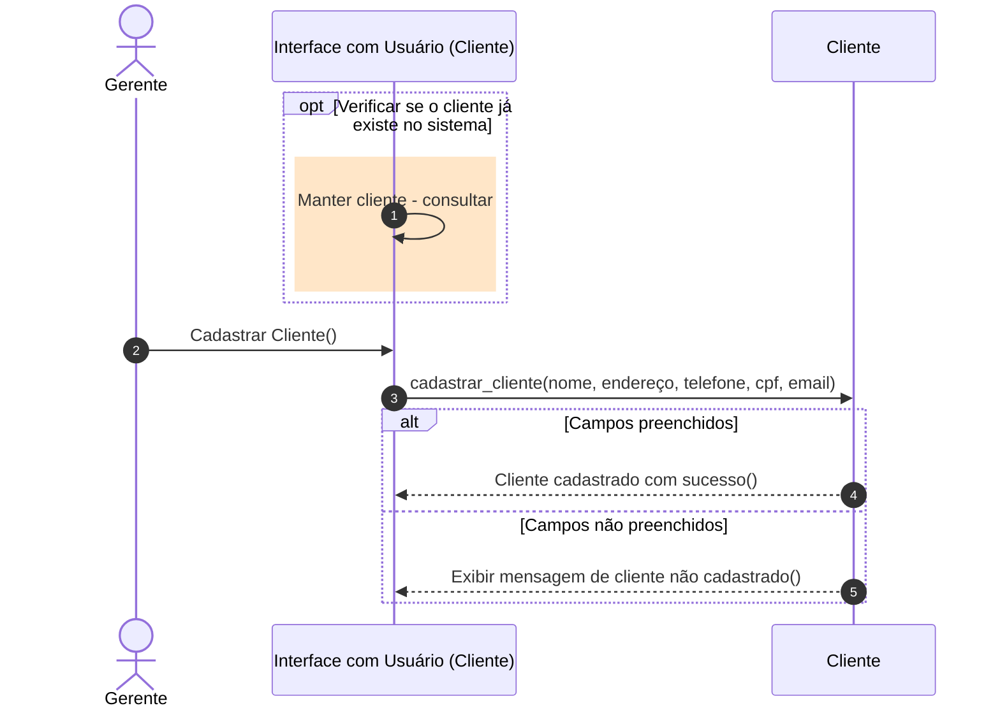
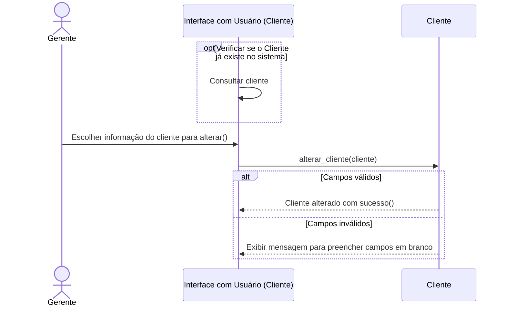
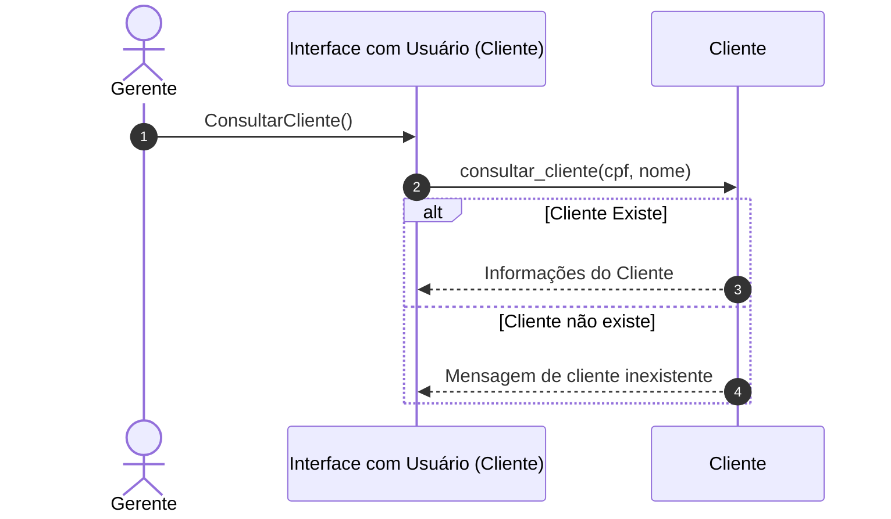
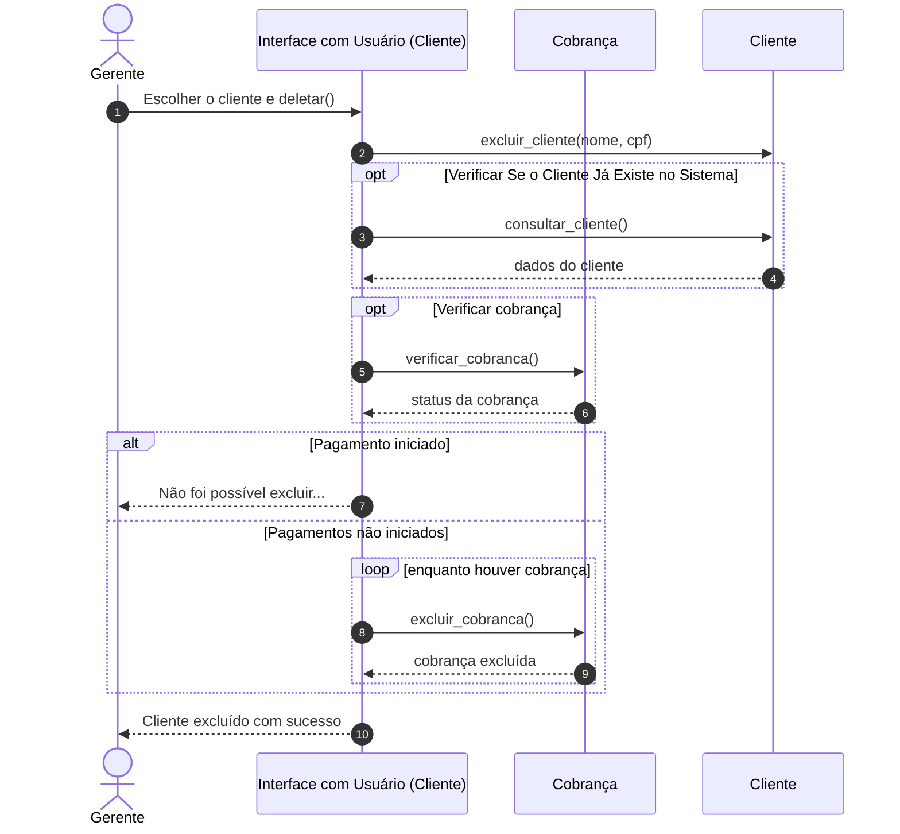
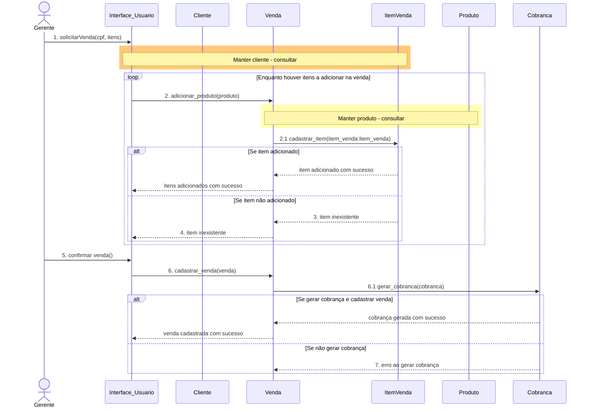

# Documento de Visão

Documento construído à parte do **Documento de requisitos do sistema: Controle de Compras e Vendas de Cosméticos** que pode ser encontrado no link: https://docs.google.com/document/d/1d2V91BRv_6ZYkVmo_FXOfOeWm__Vs_nRf30rpTrJWyw/edit?tab=t.0

## Descrição do Projeto

Este projeto trata-se de um sistema de informação de controle de compra e venda de cosméticos para revendedores autônomos que busca automatizar as vendas dos produtos disponíveis, proporcionando uma gestão eficiente e automatizando o gerenciamento de clientes, produtos, vendas e estoque.

## Diagrama de class

## Diagrama de Sequência – Manter cliente – Incluir

## Diagrama de Sequência – Manter cliente – Alterar

## Diagrama de Sequência – Manter cliente – Consultar

## Diagrama de Sequência – Manter cliente – Excluir

## Diagrama de Sequência – Realizar Venda

## Requisitos Funcionais

| Código | Descrição do requisito             | Prioridade | Tempo estimado | Tempo real | Tamanho funcional | Analista         | Desenvolvedor | Revisor | Testador |
|--------|------------------------------------|------------|----------------|------------|-------------------|------------------|---------------|---------|----------|
| RF01   | Cadastro de produtos               | Essencial  | 8h             |            |                   | Vitória Geovanna |               |         |          |
| RF02   | Cadastro de marcas                 | Desejável  | 8h             |            |                   | Vitória Geovanna |               |         |          |
| RF03   | Cadastro de vendas                 | Essencial  | 8h             |            |                   | Vitória Geovanna |               |         |          |
| RF04   | Cadastro de clientes               | Importante | 9h             |            |                   | Vitória Geovanna |               |         |          |
| RF05   | Realizar compras de mercadorias    | Essencial  | 18h            |            |                   | Vitória Geovanna |               |         |          |
| RF06   | Manter o estoque atualizado        | Importante | 24h            |            |                   | Vitória Geovanna |               |         |          |
| RF07   | Controle de compras                | Essencial  | 29h            |            |                   | Vitória Geovanna |               |         |          |
| RF08   | Controle de vendas                 | Essencial  | 29h            |            |                   | Vitória Geovanna |               |         |          |
| RF09   | Controle de produtos               | Essencial  | 29h            |            |                   | Vitória Geovanna |               |         |          |
| RF10   | Geração de relatórios              | Desejável  | 15h            |            |                   | Vitória Geovanna |               |         |          |

## Testes de Aceitação

### RF01 – Cadastro de Produtos

| Código    | Descrição                                                                                                       |
|-----------|-----------------------------------------------------------------------------------------------------------------|
| TA01.01   | Cadastro de produtos bem-sucedidos com todos os dados preenchidos.                                              |
| TA01.02   | Tentativa de cadastro com campos vazios retorna erro.                                                           |
| TA01.03   | Tentativa de cadastro com código do produto duplicado retorna erro.                                             |
| TA01.04   | Exibe uma mensagem de confirmação após o cadastro ser concluído.                                                |

### RF02 – Cadastro de Marcas

| Código    | Descrição                                                                                                       |
|-----------|-----------------------------------------------------------------------------------------------------------------|
| TA02.01   | Cadastro de marcas bem-sucedidas com todos os dados preenchidos.                                                |
| TA02.02   | Tentativa de cadastro com campos vazios retorna erro.                                                           |
| TA02.03   | Tentativa de cadastro com CNPJ da marca duplicada retorna erro.                                                 |
| TA02.04   | Exibe uma mensagem de confirmação após o cadastro ser concluído.                                                |

### RF03 – Cadastro de Vendas

| Código    | Descrição                                                                                                       |
|-----------|-----------------------------------------------------------------------------------------------------------------|
| TA03.01   | Cadastro de vendas bem-sucedidas com todos os dados preenchidos.                                                |
| TA03.02   | Tentativa de cadastro com campos vazios retorna erro.                                                           |
| TA03.03   | Tentativa de cadastro com id da venda duplicada retorna erro.                                                   |
| TA03.04   | Exibe uma mensagem de confirmação após o cadastro ser concluído.                                                |

### RF04 - Cadastro de clientes

| Código    | Descrição                                                                                                       |
|-----------|-----------------------------------------------------------------------------------------------------------------|
| TA04.01   | Cadastro de clientes bem-sucedidos com todos os dados preenchidos.                                              |
| TA04.02   | Tentativa com campos vazios retorna erro.                                                                       |
| TA04.03   | Tentativa de cadastro com CPF do cliente duplicado retorna erro.                                                |
| TA04.04   | Tentativa de cadastro com CPF do cliente inválido retorna erro.                                                 |
| TA04.05   | Exibe uma mensagem de confirmação após o cadastro ser concluído.                                                |

### RF05 - Realizar compra de mercadorias

| Código    | Descrição                                                                                                       |
|-----------|-----------------------------------------------------------------------------------------------------------------|
| TA05.01   | Realização de compras bem-sucedidas com todos os dados preenchidos.                                             |
| TA05.02   | Tentativa com campos vazios retorna erro.                                                                       |
| TA05.03   | Tentativa de compra de mercadoria com estoque, o sistema informa a quantidade em estoque.                       |
| TA05.04   | Exibe uma mensagem de confirmação após a realização ser concluída.                                              |

### RF06 - Manter o estoque atualizando

| Código    | Descrição                                                                                                       |
|-----------|-----------------------------------------------------------------------------------------------------------------|
| TA06.01   | Realização do estoque bem-sucedido com todos os dados atualizados.                                              |
| TA06.02   | Tentativa com campos vazios retorna erro.                                                                       |
| TA06.03   | Não permite a desatualização do estoque.                                                                        |
| TA06.04   | Exibe uma mensagem de confirmação após a realização ser concluída.                                              |

### RF07 - Controle de compras

| Código    | Descrição                                                                                                       |
|-----------|-----------------------------------------------------------------------------------------------------------------|
| TA07.01   | Realização do controle das compras bem-sucedidas com todos os dados atualizados.                                |
| TA07.02   | Tentativa com campos vazios retorna erro.                                                                       |
| TA07.03   | Não permite a desatualização das compras.                                                                       |
| TA07.04   | Exibe uma mensagem de confirmação após a realização ser concluída.                                              |

### RF08 – Controle de Vendas

| Código    | Descrição                                                                                                       |
|-----------|-----------------------------------------------------------------------------------------------------------------|
| TA08.01   | Realização do controle das vendas bem-sucedidas com todos os dados atualizados.                                 |
| TA08.02   | Tentativa com campos vazios retorna erro.                                                                       |
| TA08.03   | Não permite a desatualização das vendas.                                                                        |
| TA08.04   | Exibe uma mensagem de confirmação após a realização ser concluída.                                              |
| TA08.05   | Tentativa de venda sem estoque retorna erro.                                                                    |
| TA08.06   | Tentativa de venda para clientes com débitos pendentes retorna erro.                                            |

### RF09 – Controle de Produtos (Estoque)

| Código    | Descrição                                                                                                       |
|-----------|-----------------------------------------------------------------------------------------------------------------|
| TA09.01   | Realização do controle dos produtos bem-sucedidos com todos os dados atualizados.                               |
| TA09.02   | Tentativa com campos vazios retorna erro.                                                                       |
| TA09.03   | Não permite a desatualização dos produtos.                                                                      |
| TA09.04   | Exibe uma mensagem de confirmação após a operação ser concluída.                                                |

### RF10 – Gerar Relatórios

| Código    | Descrição                                                                                                       |
|-----------|-----------------------------------------------------------------------------------------------------------------|
| TA10.01   | Realização de relatórios de produtos, marcas, vendas e clientes bem-sucedidos com todos os dados atualizados.   |
| TA10.02   | Tentativa com campos vazios retorna erro.                                                                       |
| TA10.03   | Não permite a desatualização dos relatórios de produtos, marcas, vendas e clientes.                             |
| TA10.04   | Exibe uma mensagem de confirmação após a realização ser concluída.                                              |
