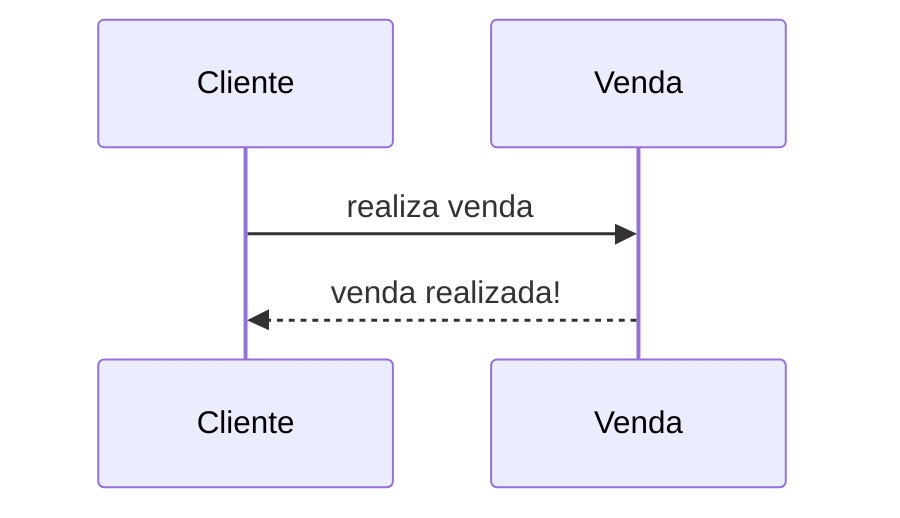

# Descrição

Sistema de informação de Controle de Compra e Venda de Cosméticos para revendedores automonos.

## Documentos

* [Documento de Visão](Documetos/Documento_visao.md)

## Como executar o projeto

## Outras Informações

* [Guia Básico de Markdown](https://docs.pipz.com/central-de-ajuda/learning-center/guia-basico-de-markdown#open)
* [Documentação do Mermaid](https://docs.mermaidchart.com/mermaid-oss/intro/index.html)
* [Github do Engenharia de Software II](https://github.com/tacianosilva/eng-software-2)

### Exemplo de Diagrama de Sequência com Mermaid

